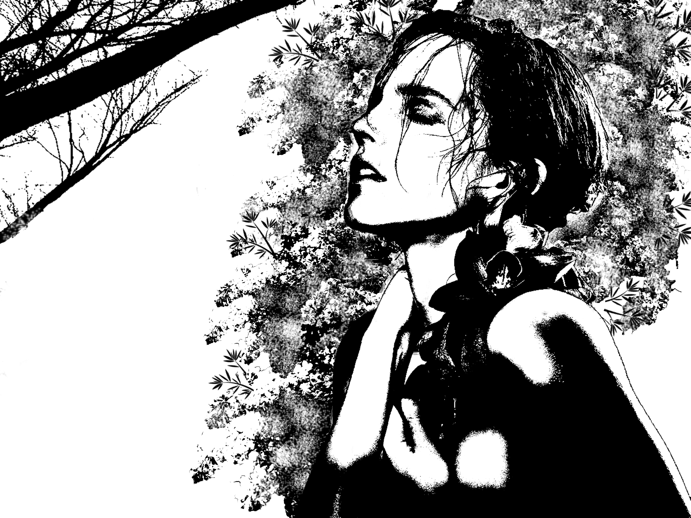

+++
    #this is the "front matter" of the template of a project. It's the variables associated with the file
    #this portion is written in TOML (Tom's Obvious Minimal Language)
    
    title = "SEASON"
    #replace takes the filename and replaces all hyphens with spaces so that when it appears on your page, it's using spaces. The filename is used in the URL and URLs can't have spaces so use hyphen in the filename.
    #title converts to title-case (using capital letters for principal words only)
    
    date = 2019-06-04T01:42:19-07:00 #the date the file was created

    
    shortDescription = "Thoughts on the SEASONS."
    projectVideo = ""
    #Project video is just the unique part of the URL  
    # For example, if the link is https://vimeo.com/285189099 then the unique part is  285189099
    projectVideoType = ""
    #Enter "youtube" or "vimeo". You can add other video types as well by editing single.html 
    projectImage = "LuceroCortesB&W.jpg"
    #Enter the filename only. For example, "metropolis_album.jpg" 
    #This image should be saved in the project folder with the name of your project 
    projectImageAltText = ""
    #Alt text is the text that gets read by screenreaders for accessibility (typically for the visually impaired) 

+++

    

        
    

        

            <h1 class= "image-title">Season</h1>
        

    <h1 class= "girl-text">
        With the image of a full branch behind a young woman and a bare branch to the side, I wanted to capture a small piece of winter and spring with a foreground of summer (the girl). Each image tells something different for all three implied seasons. It is the woman who says the most as we wonder about her blissful expression.
    </h1>

